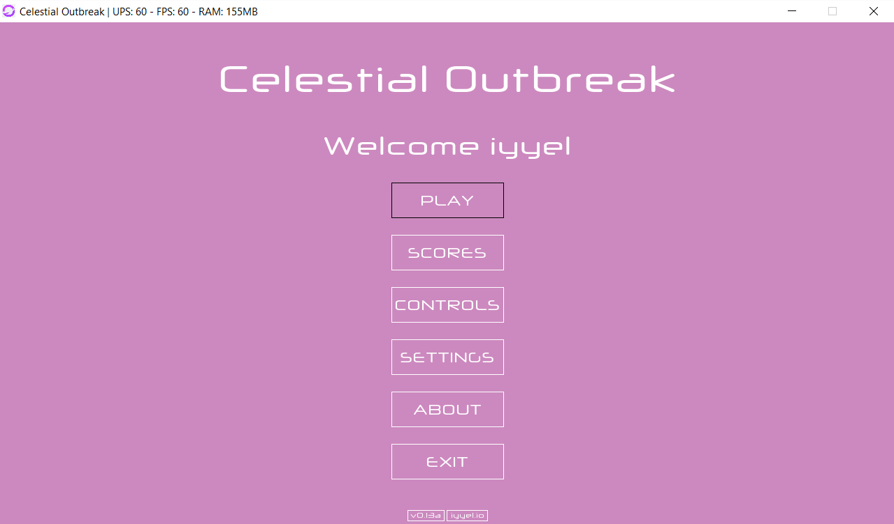
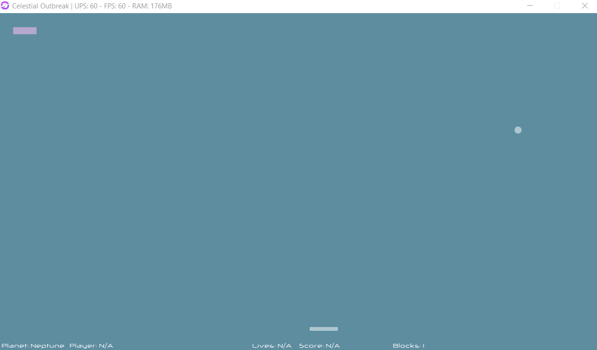

# Celestial Outbreak

Welcome to Celestial Outbreak. A Breakout-like game inspired by planets with a focus on game and user customization. Currently in development, written in Java with limited use of third-party libraries.

## Release
Version 0.13 alpha has been released.

## What's new
I've been focusing on finalizing the menu system and player system in this release, plus a few additional things, such as new sounds etc.

* The user is now able to create players, select between the created players and delete them again, all in the menu.
* Menu navigation is rewritten and works a lot better.
* A lot of other small things, bug fixes, changes, etc.

## Main Menu

## Level

## License 

