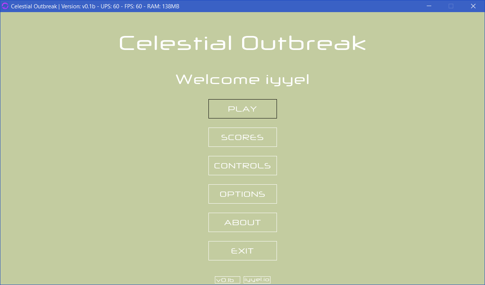
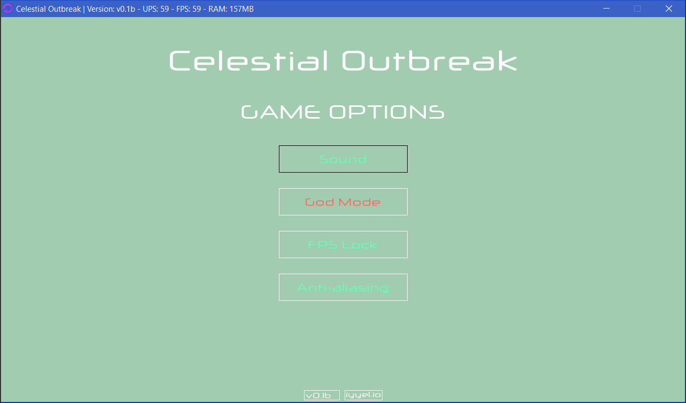
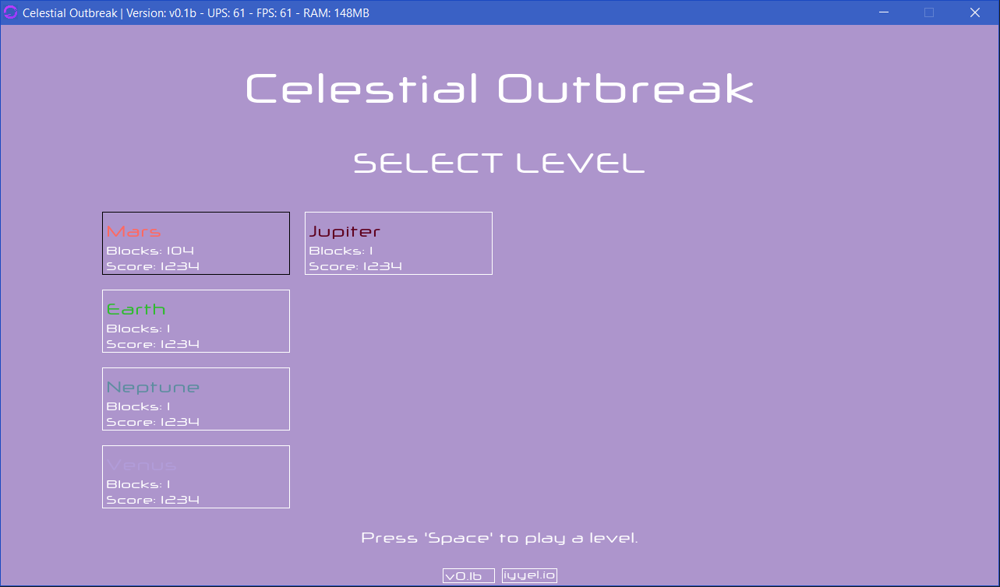
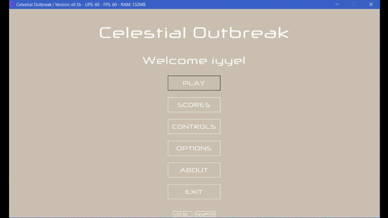

# Celestial Outbreak

Welcome to Celestial Outbreak. Celestial Outbreak is a open source Breakout-like, planet inspired video game, implemented in core Java with little to no use of third party libraries. Includes fully customizable levels and game configuration. The main purpose of this project was to create a stand-alone game with simple controls together with a great user experience, using core Java only.

## Status
Currently in development.

## Release
Version 0.1 Beta has been released.

## What's new
The state of the game has been updated to Beta, since one is now fully able to navigate around and play the game. The menu navigation system has been finished and polished, so focus has changed to the actual gameplay.

* The user is now able to select which level they want to play through a menu screen.
* Menu navigation system is finished.
* In-game options has been added.
* A lot of other small things, bug fixes, changes, etc.

Any ideas or suggestions? Do not hesitate to contact me here or on my e-mail i@iyyel.io.

## Main Menu

## Game Options

## Level Selection

## Gameplay

