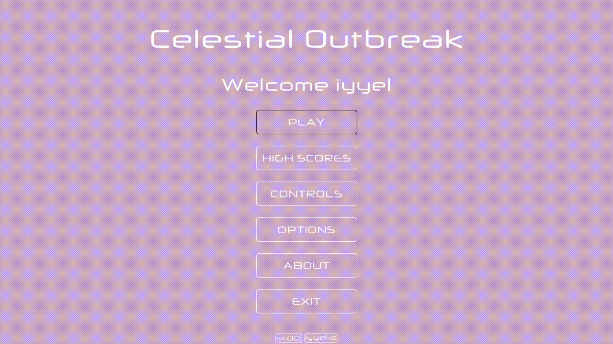
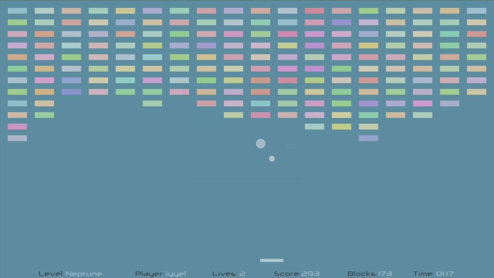
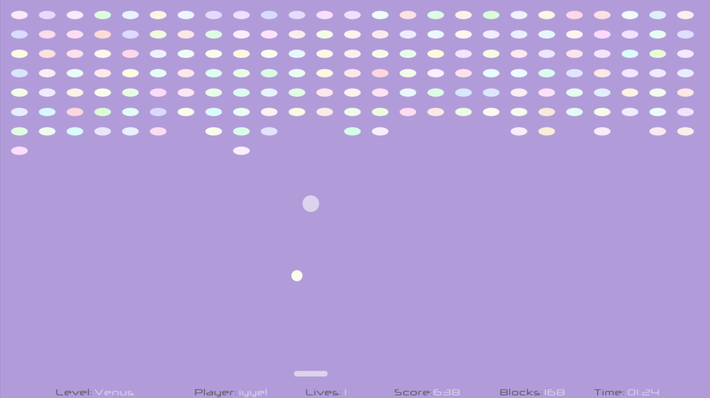
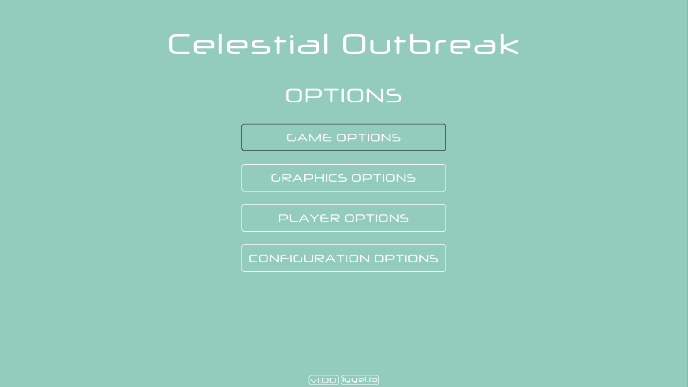
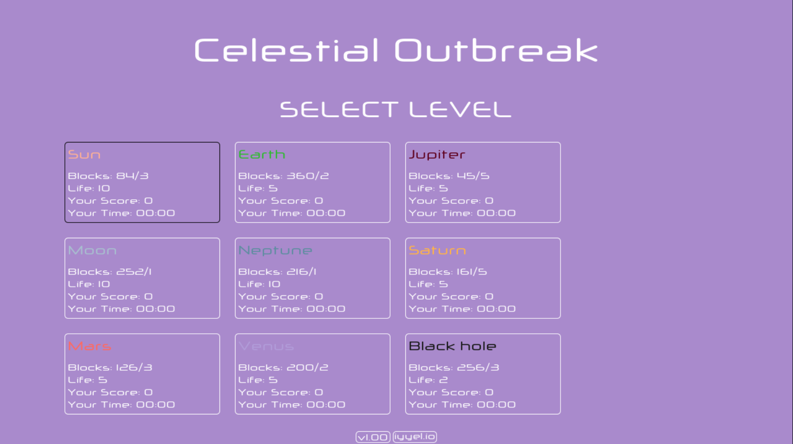

[![Contributors][contributors-shield]][contributors-url]
[![Forks][forks-shield]][forks-url]
[![Stargazers][stars-shield]][stars-url]
[![Issues][issues-shield]][issues-url]
[![MIT License][license-shield]][license-url]

 

  

  

     
    🚀 A highly customizable, space-themed Breakout-inspired video game
     
  

## Table of Contents
- [Introduction](#introduction)
- [Built With](#built-with)
- [Getting Started](#getting-started)
- [Usage](#usage)
- [Gameplay](#gameplay)
- [License](#license)
- [Contact](#contact)

## Introduction
[![Celestial Outbreak][product-screenshot]](https://github.com/iyyel/celestial-outbreak)

**Celestial Outbreak** is a space-themed 2D video game similar to Breakout, developed in Java.
It offers the classic Breakout gameplay with a colorful interface and some additional features.
The game is designed for customization, allowing players to create their own levels by adjusting
properties like the dimensions, size, speed, and color of the blocks, paddle, ball, and power-ups.

The aim of this project was to develop a simple 2D game with minimal use of third-party libraries. 
uses only the Graphics2D library for drawing shapes on the screen. The game's flow is managed by a
finite-state machine, simplifying the process of determining which screen to display and which audio
track to play.

## Built With
**Celestial Outbreak** is built with the following technologies:

* [Java](https://java.com/en/)
* [Graphics2D](https://docs.oracle.com/javase/7/docs/api/java/awt/Graphics2D.html/) (Java library)

## Getting Started
* Make sure you have the latest version of Java installed. Java can be installed from [here](https://java.com/en/).
* Download and install a compatible IDE such as [IntelliJ IDEA](https://www.jetbrains.com/idea/download) or a text editor like [Visual Studio Code](https://code.visualstudio.com/)

## Usage
To use **Celestial Outbreak**

* Download or clone this repository
* Open it in your IDE or text editor of choice
* Run the `Main.java` class to start the game

## Gameplay

#### **Mars**

#### **Neptune**

#### **Venus**

#### **Options menu**

#### **Level selection menu**

## License
Distributed under the MIT License. See [LICENSE.md](LICENSE.md) for more information.

## Contact
Daniel Larsen (iyyel) - [iyyel.io](https://iyyel.io) - [hello@iyyel.io](mailto:hello@iyyel.io)

<!-- MARKDOWN LINKS & IMAGES -->
[contributors-shield]: https://img.shields.io/github/contributors/iyyel/celestial-outbreak.svg?style=for-the-badge
[contributors-url]: https://github.com/iyyel/celestial-outbreak/graphs/contributors
[forks-shield]: https://img.shields.io/github/forks/iyyel/celestial-outbreak.svg?style=for-the-badge
[forks-url]: https://github.com/iyyel/celestial-outbreak/network/members
[stars-shield]: https://img.shields.io/github/stars/iyyel/celestial-outbreak.svg?style=for-the-badge
[stars-url]: https://github.com/iyyel/celestial-outbreak/stargazers
[issues-shield]: https://img.shields.io/github/issues/iyyel/celestial-outbreak.svg?style=for-the-badge
[issues-url]: https://github.com/iyyel/celestial-outbreak/issues
[license-shield]: https://img.shields.io/github/license/iyyel/celestial-outbreak.svg?style=for-the-badge
[license-url]: https://github.com/iyyel/celestial-outbreak/LICENSE.md
[product-screenshot]: images/main_menu.png
